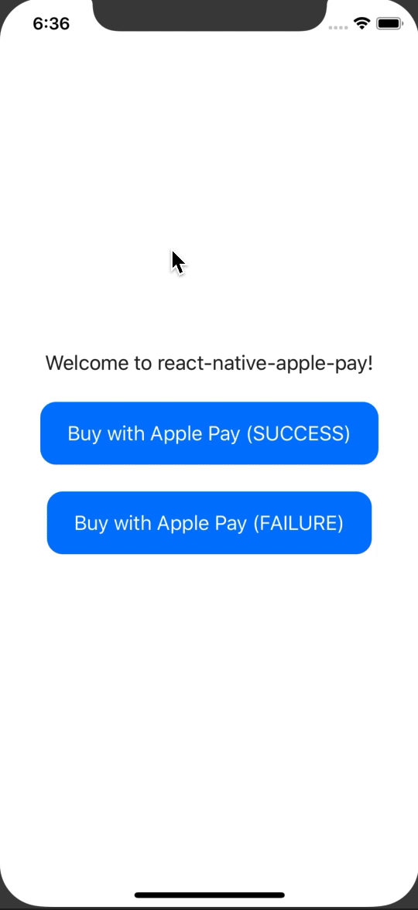

# react-native-apay
[](https://github.com/facebook/react-native/releases/tag/v0.41.0)

[](https://github.com/busfor/react-native-apay/tree/master)

Accept Payments with Apple Pay for React Native apps.

<div>

</div>

---

## Getting started

`$ yarn add react-native-apay`

### Mostly automatic installation

`$ react-native link react-native-apay`

### Manual installation


#### iOS

1. In XCode, in the project navigator, right click `Libraries` ➜ `Add Files to [your project's name]`
2. Go to `node_modules` ➜ `react-native-apay` and add `RNApplePay.xcodeproj`
3. In XCode, in the project navigator, select your project. Add `libRNApplePay.a` to your project's `Build Phases` ➜ `Link Binary With Libraries`
4. Run your project (`Cmd+R`)<


## Usage
```javascript
import { ApplePay } from 'react-native-apay';

const requestData = {
  merchantIdentifier: 'merchant.com.example',
  supportedNetworks: ['mastercard', 'visa'],
  countryCode: 'US',
  currencyCode: 'USD',
  paymentSummaryItems: [
    {
      label: 'Item label',
      amount: '100.00',
    },
  ],
}

// Check if ApplePay is available
if (ApplePay.canMakePayments) {
  ApplePay.requestPayment(requestData)
    .then((paymentData) => {
      console.log(paymentData)
      // Simulate a request to the gateway
      setTimeout(() => {
        // Show status to user ApplePay.SUCCESS || ApplePay.FAILURE
        ApplePay.complete(ApplePay.SUCCESS)
      }, 1000)
    })
}
```

## Demo
You can run the demo by cloning the project and running:

`$ yarn demo`
